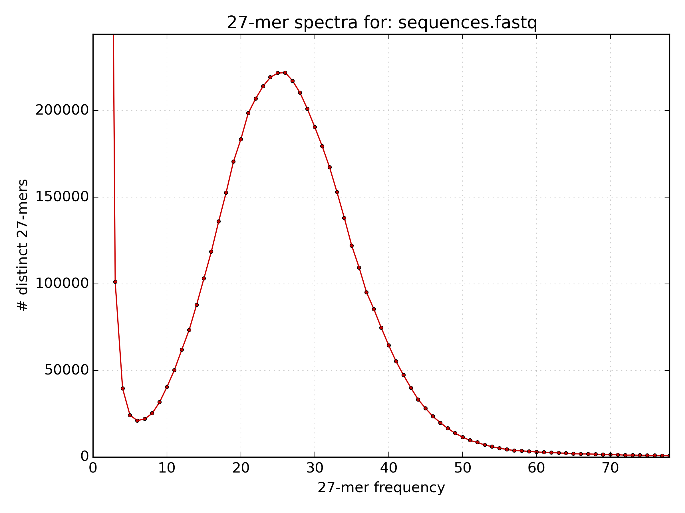
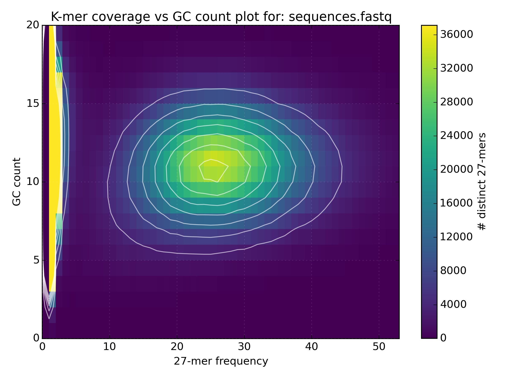
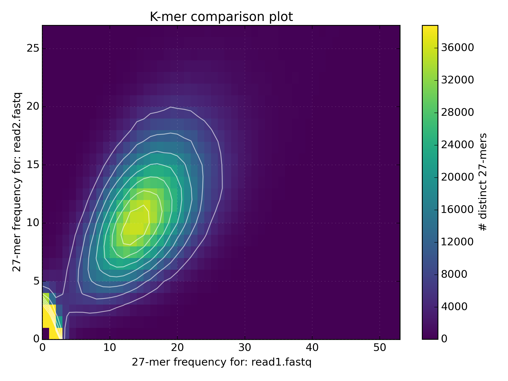
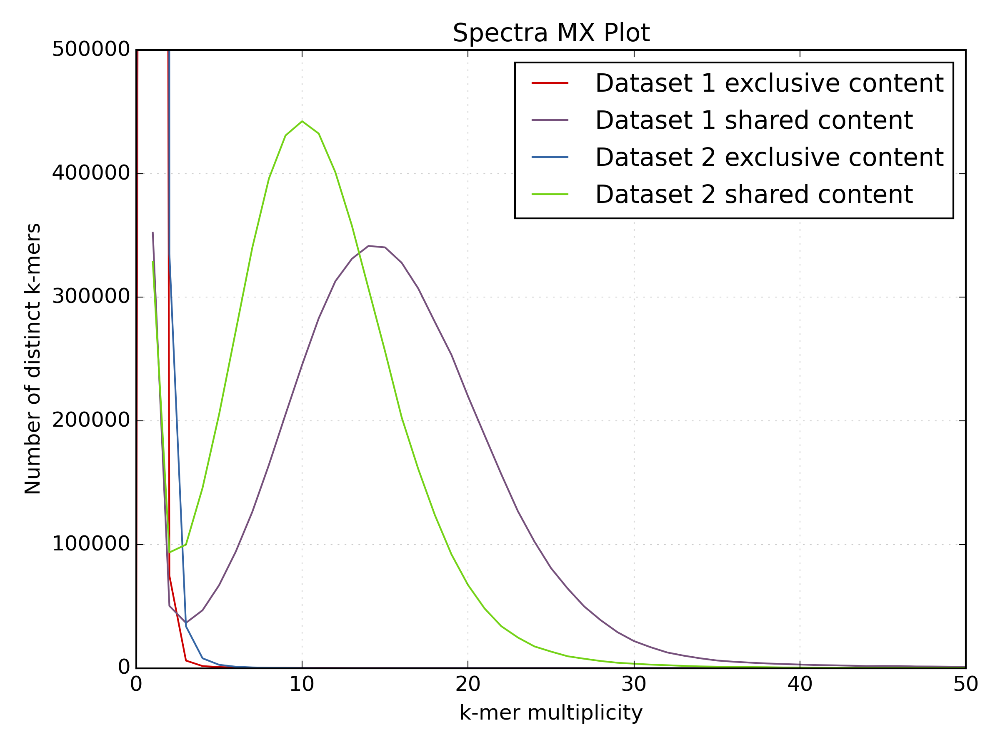
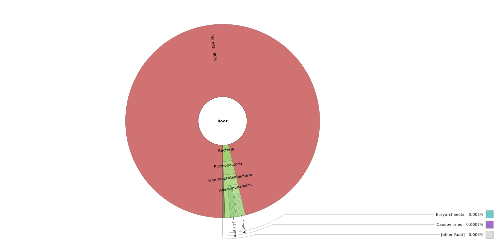
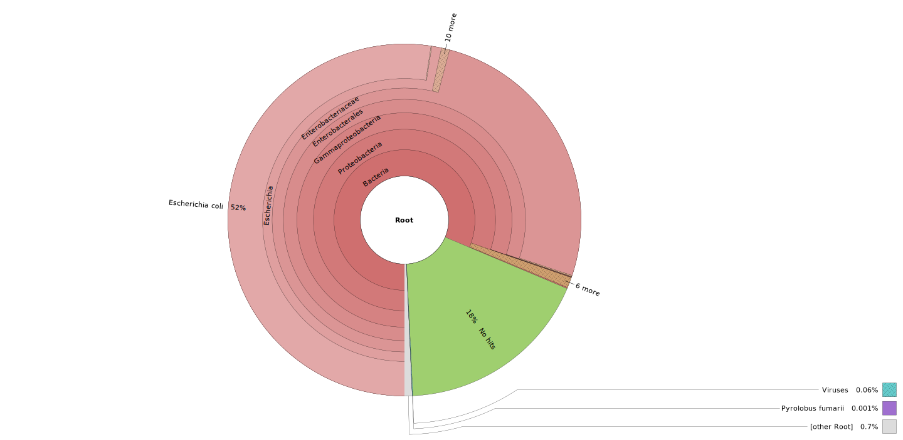

# Exercise: K-mer and contamination analysis

## Exercises:

1. What is a k-mer?

	**solution**
	
	A k-mer is a sequence of length k.

2. Use the following set of commands to extract the list of k-mers in `Bacteria/bacteria_R{1,2}.fastq.gz`.
	
	```bash
	mkfifo <named_pipe.fastq> && zcat <reads.fastq.gz> > <named_pipe.fastq> & # Make a named pipe and run in the background
	kat hist -t 4 -d -o <output.hist> <named_pipe.fastq> # Run KAT reading from the named pipe
	kat_jellyfish dump <output.hist>-hash.jf27 > <kmer.lst> # Use Jellyfish to print out a human readable list
	rm <named_pipe.fastq> # named pipes can only be used once, and so are removed after use.
	```
	The **<kmer.lst>** file has the following format.
	```
	>frequency
	kmer_sequence
	```
	How many distinct k-mers were found? Use the line count command `wc -l` to find out.

	**solution**
	
	```bash
	mkfifo sequences.fastq && zcat bacteria_R{1,2}.fastq.gz > sequences.fastq &
	kat hist -t 4 -d -o bacteria.hist sequences.fastq
	kat_jellyfish dump bacteria.hist-hash.jf27 > kmer.lst
	rm sequences.fastq
	paste - - < kmer.lst | wc -l
	  41531545
	```

3. How many k-mers have a frequency of 1?  Use the following command to find out.
	```bash
	paste - - < kmer.lst | cut -c2- | awk '$1 == 1 { sum++ } END { print sum+0 }'
	# paste - - : reads two consecutive lines onto the same line.
	# cut -c2- : prints from the second character up to the last character in a line.
	# awk '$1 == 1 { sum++ } END { print sum+0 }' : if column 1 has a frequency of 1, increase the variable "sum". Print the value of "sum" at the end.
	```
	
	**solution**
	
	35701246

4. How many k-mers have a frequency greater than 5?
	
	**solution**
	
	```bash
	paste - - < kmer.lst | cut -c2- | awk '$1 > 5 { sum++ } END { print sum+0 }'
	  4969071
	```

5. A k-mer histogram was plotted using `kat hist` in a file `*.hist.png`. Open the image using `display` and estimate the mean k-mer frequency.
	
	**solution**
	
	
	The mean k-mer frequency appears to be around 25.

6. The following command prints the frequency of each k-mer frequency between 5 and 45. What is the mean k-mer frequency?
	```bash
	paste - - < kmer.lst | cut -c2- | awk '$1 > 5 && $1 < 45 {sum[$1]++ } END { for (freq in sum) {print freq" "sum[freq]} }' | sort -k1,1n
	# paste - - : reads two consecutive lines onto the same line.
	# cut -c2- : prints from the second character up to the last character in a line.
	# awk '$1 > 5 && $1 < 45 {sum[$1]++ } END { for (freq in sum) {print freq" "sum[freq]} }' :
	# 	if column 1 has a frequency greater than 5 and less than 45, increase the value of the array "sum[frequency]" by 1.
	# 	Then for each frequency in sum print the value of sum[frequency] at the end.
	# sort -k1,1n : Perform a numerical sort on the data sorted only by column 1
	```
	
	**solution**
	
	The mean k-mer frequency is the k-mer frequency (column 1) with the highest count (column 2), which is 26.

7. Use `kat gcp` to plot the gc content vs k-mer frequency.
	```bash
	mkfifo <named_pipe.fastq> && zcat <reads.fastq.gz> > <named_pipe.fastq> & # Make a named pipe and run in the background
	kat gcp -t 4 -o <output.gcp> <named_pipe.fastq> # Run KAT reading from the named pipe
	rm <named_pipe.fastq> # named pipes can only be used once, and so are removed after use.
	```
	Open the plot of GC vs coverage. On what scale is the GC content measured and how is this converted to GC%?

	**solution**
	
	```bash
	mkfifo sequences.fastq && zcat bacteria_R{1,2}.fastq.gz > sequences.fastq &
	kat gcp -t 4 -o bacteria.gcp sequences.fastq
	rm sequences.fastq
	```
	
	
	The scale of GC content is the k-mer size, which is in this case 27 (Note: The image
	does not go all the way to 27 since the y-axis has been cropped for some reason).
	In order to find GC%, one should multiply the GC count by 100% divided by the k-mer size
	(e.g. the mean GC count is at 11, and so the mean GC% is 11 * 100 / 27 = 40.74%). 	 

8. Use `kat comp` to compare `Bacteria/bacteria_R{1,2}.fastq.gz`.
	```bash
	mkfifo <named_pipe_read1.fastq> && zcat <read1.fastq.gz> > <named_pipe_read1.fastq> & # Make a named pipe for read 1 and run in background
	mkfifo <named_pipe_read2.fastq> && zcat <read2.fastq.gz> > <named_pipe_read2.fastq> & # Make a named pipe for read 2 and run in background
	kat comp -t 4 -o <output.cmp> --density_plot <named_pipe_read1.fastq> <named_pipe_read2.fastq> # run KAT on the named pipes and print a density plot
	kat plot spectra-mx -x 50 -y 500000 -i -o <output.cmp>-main.mx.spectra-mx.png <output.cmp>-main.mx # Make a spectra-mx plot
	rm <named_pipe_read1.fastq> <named_pipe_read2.fastq> # names pipes can only be used once, and so are removed after use
	```

	Why is there a difference in the distribution means between the two datasets?

	**solution**
	
	```bash
	mkfifo read1.fastq && zcat bacteria_R1.fastq.gz > read1.fastq &
	mkfifo read2.fastq && zcat bacteria_R2.fastq.gz > read2.fastq &
	kat comp -t 4 -o bacteria_R1vR2.cmp --density_plot read1.fastq read2.fastq
	kat plot spectra-mx -x 50 -y 500000 -i -o bacteria_R1vR2.cmp-main.mx.spectra-mx.png bacteria_R1vR2.cmp-main.mx
	rm read1.fastq read2.fastq
	```
	
	
	
	
	
	The difference in the distribution means between the two datasets is due to the lower quality
	of the second read file. The increased number of reads with N's reduces the k-mer count frequency
	as k-mers with N are not included in the plot. This increases the number of k-mers with
	lower k-mer frequency.

9. Run Kraken on `Bacteria/bacteria_R{1,2}.fastq.gz`. What is the reason for this result? Can one do better?
	```bash
	KRAKEN_DB=/sw/courses/assembly/minikraken_20141208
	kraken --threads 4 --db $KRAKEN_DB --fastq-input --gzip-compressed --paired <read_{1,2}.fastq.gz> > <kraken.out>
	kraken-report --db $KRAKEN_DB <kraken.out> > <kraken.rpt>
	cut -f2,3 <kraken.out> > <krona.in>
	ktImportTaxonomy <krona.in> -o <krona.html>
	```

	**note**: `ktImportTaxonomy` is now a broken link. Use this file instead:
	```bash
	/sw/apps/bioinfo/Krona/2.7/src/KronaTools-2.7/scripts/ImportTaxonomy.pl
	```

	**solution**
	
	```bash
	kraken --threads 4 -db $KRAKEN_DB --fastq-input --gzip-compressed --paired bacteria_R{1,2}.fastq.gz > bacteria.kraken.out
	kraken-report -db $KRAKEN_DB bacteria.kraken.out > bacteria.kraken.rpt
	cut -f2,3 bacteria.kraken.out > bacteria.krona.in
	/sw/apps/bioinfo/Krona/2.7/src/KronaTools-2.7/scripts/ImportTaxonomy.pl bacteria.krona.in -o bacteria.krona.html
	```
	
	
	
	Here you see that very little is identified, indicating that the organism is not in the
	database. As a result, the other organisms it has identified are likely to be false positives.
	One could make this better by using the full database.

10. Run Kraken on `Ecoli/E01_1_135x.fastq.gz`. What do you find here and how does the error rate influence this finding?

	**solution**
	
	```bash
	kraken --threads 4 -db $KRAKEN_DB --fastq-input --gzip-compressed E01_1_135x.fastq.gz > Ecoli.kraken.out
	kraken-report -db $KRAKEN_DB Ecoli.kraken.out > Ecoli.kraken.rpt
	cut -f2,3 Ecoli.kraken.out > Ecoli.krona.in
	/sw/apps/bioinfo/Krona/2.7/src/KronaTools-2.7/scripts/ImportTaxonomy.pl Ecoli.krona.in -o Ecoli.krona.html
	```
	
	
	
	Here you see quite a lot of the sequences identified as E. coli, however due to
	the increased error rate per base of the subreads, less reads are accurately classified.  
