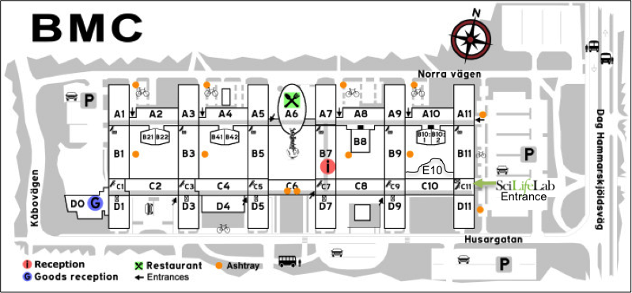

# Maps & Travel Info

## Uppsala Biomedical Center (BMC)

[Map to BMC](https://goo.gl/maps/YQSdtGx2paD2)

Enter through the C11 entrance, now also called the SciLife entrance. Forward and and to the right 
from the C11 entrance is the door to the new SciLife building ("the Hub"; E10 on the map) built on 
one of the inner courtyards of BMC. If you do not have an access card you will need someone to let 
you in through to the door to the Hub. The room for the course, E10:1307, is on the ground floor of 
the new building.

## Travel Information

The BMC can be reached either by bus or walking (< 30 mins) from Central Uppsala.

Please see [www.ul.se](http://www.ul.se) for timetables. Use the UL journey planner and search the addresses as written below.

From **Uppsala central station** to **Uppsala Science Park** (BMC) 5-7 min  
From **Slottsbacken** (a few minutes walk from Akademihotellet) – **Uppsala Science Park** (BMC) 7 min  
From **Kungsgärdets** center (close to Hotel Charlotte) – **Uppsala Science Park** (BMC) 20-25 min  

## Activities and Restaurants

Check out [Destination Uppsala](http://www.destinationuppsala.se/en/) for some suggestions.

